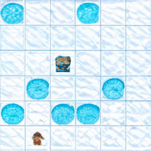
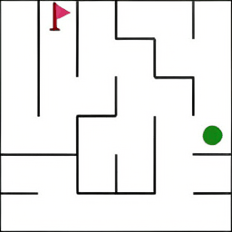

<h3 align="center">
  <a href="https://arxiv.org/abs/2505.11409">
    Visual Planning: Let's Think Only with Images
  </a>
</h3>
<h5 align="center"> If you find this project interesting, please give us a star ⭐ on GitHub to support us. 🙏🙏 </h2>


<p align="center">
  <a href="https://arxiv.org/abs/2505.11409">
    
  </a>
  <a href="https://huggingface.co/papers/2505.11409">
    
  </a>
  <a href="https://opensource.org/licenses/MIT">
    
  </a>
</p>

<p align="center">
  
</p>

### 💡 Overview
We introduces *Visual Planning*, a new reasoning paradigm where planning is conducted entirely through sequences of images, without relying on language. Unlike traditional multimodal models that use visual input but still reason in text, our approach enables models to "think" directly in the visual domain. We propose a reinforcement learning framework, VPRL, which significantly outperforms language-based baselines on spatial navigation tasks.


### ✨ Method
We propose a novel two-stage reinforcement learning training framework:
- **Stage 1: Policy Initialization**: Acquire the effective exploration capabilit and Produce visually coherent output. 
- **Stage 2: Reinforcement Learning for Visual Planning**: Learn to simulate future visual states and plan effectively via Group Relative Policy Optimization (GRPO), guided by our proposed *Progress Reward*.


### 📊 Evaluation
We evaluate VPRL across three diverse visual planning environments:


-  **FrozenLake:**  
  A stochastic gridworld where the agent is supposed to start from the designated position and find its way to the destination safely without falling into the 'holes'

<div align="center">
  
</div>

  

-  **Maze:**  
  Given an initial image describing the maze layout, the model is supposed to go through the maze from the starting point (green point) to the destination (red flag).

<div align="center">
  
</div>

-  **MiniBehaviour:**  
  The agent is first required to reach the printer from the starting point and pick it up. After that, the agent should go to the table and drop the printer.

<div align="center">
  
</div>

### 🤗 Models and Datasets

We currently provide the evaluation code to support reproducibility. The model checkpoints and datasets will be released in the near future.

### 📑 Citation

If you find Visual Planning useful for your research and applications, please cite using this BibTeX:

```bibtex
@misc{xu2025visualplanningletsthink,
      title={Visual Planning: Let's Think Only with Images}, 
      author={Yi Xu and Chengzu Li and Han Zhou and Xingchen Wan and Caiqi Zhang and Anna Korhonen and Ivan Vulić},
      year={2025},
      eprint={2505.11409},
      archivePrefix={arXiv},
      primaryClass={cs.LG},
      url={https://arxiv.org/abs/2505.11409}, 
}
```